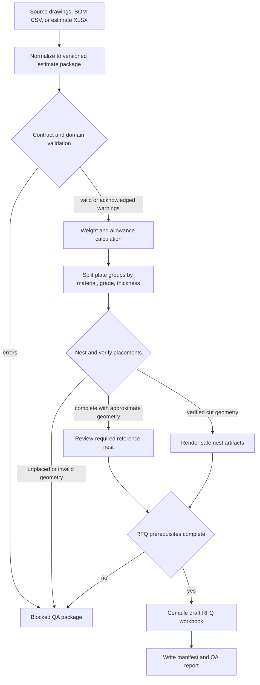
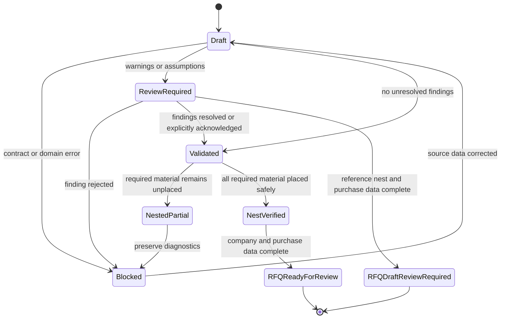

# feat: Build a Trustworthy Estimate Package

## Summary

Make v0.3 a reliability milestone that turns the advertised takeoff → nest → RFQ workflow into a deterministic, review-gated estimate package. Correct the unsafe burn-output boundary first, then add shared contracts, strict validation, deterministic RFQ generation, orchestration, and release-quality verification.

---

## Problem Frame

The package has a credible steel-domain foundation and a substantial plate-nesting engine, but the three skills do not yet form an executable pipeline. `steel-takeoff` produces a loosely defined CSV, `steel-nest` consumes an unrelated JSON job, and `steel-rfq` describes a workbook that the agent must recreate on every run. Only the nesting-to-RFQ JSON handoff is implemented.

The most urgent defect is operational: irregular parts are packed by bounding box and that same rectangle is emitted on the burn DXF `PROFILE` layer. A gusset or other irregular part can therefore look cut-ready even though the file does not contain its true outline. The package also lacks input schemas, independent placement verification, automated tests, CI, declared Python requirements and supported version ranges, and a safe location for user company configuration.

This milestone should make the current promise trustworthy before adding more standalone skills. It does not automate vendor communication or authorize commercial decisions.

---

## Requirements

### Safety and validation

- R1. Burn files must contain only verified cutting entities and must never present bounding boxes, sheet outlines, labels, or unresolved irregular geometry as verified CAM-import profiles.
- R2. Every executable stage must validate its input before generating downstream artifacts and return field-specific errors for malformed data.
- R3. Nesting must independently verify material compatibility, positive finite dimensions, hole containment, plate bounds, required clearances, and non-overlap.
- R4. Unplaced parts and blocking validation errors must prevent a package from reaching RFQ-ready status.
- R5. Packing utilization and net material yield must be named and calculated separately so holes and irregular-part areas cannot make one generic yield value misleading.

### Traceability and commercial controls

- R6. The canonical estimate must preserve stable item IDs, source revision, drawing sheet/detail, quantity basis, assumptions, exclusions, and review status when those facts are available.
- R7. Pricing inputs and allowances must record their basis and effective context; no output may present hard-coded sensitivity rates as current market pricing.
- R8. RFQ workbooks must be deterministic drafts generated from validated data and must require a complete company profile without storing runtime company data inside the installed package.
- R9. The system must generate artifacts only; sending RFQs, selecting vendors, accepting substitutions, and making awards remain explicit human actions outside this milestone.
- R10. Estimate items must distinguish fabricated parts, purchased stock, hardware, allowances, exclusions, and by-others scope so calculated allowances cannot silently become vendor quantities.
- R11. On-hand stock and purchasable stock must remain distinct so consumed inventory is traceable but omitted from vendor purchase quantities.

### Pipeline and compatibility

- R12. One orchestration skill must normalize, validate, calculate, nest, and generate the draft RFQ while preserving identifiers between stages.
- R13. Every artifact-producing command must emit `run-manifest.json` containing schema versions, tool versions, input and configuration hashes, explicit dates, warnings, approximations, stage outcome, and an allow-list of produced artifacts.
- R14. Existing direct-use commands and documented CSV/JSON inputs must either remain compatible through adapters or receive an explicit migration path.

### Quality and distribution

- R15. Money-, weight-, geometry-, and workbook-affecting behavior must have repeatable unit, invariant, integration, and golden-contract coverage.
- R16. A clean supported environment must be able to diagnose missing dependencies and verify the contents of the published npm tarball.
- R17. Documentation must distinguish estimating assistance from structural design and burn DXF import geometry from machine-ready NC/G-code.
- R18. Any named CAM compatibility or geometry-readiness claim must be backed by a recorded import acceptance check for that product and version.

---

## Key Technical Decisions

- **Canonical contract is versioned JSON with adapters:** use one normalized estimate-package model for internal handoffs while retaining CSV/XLSX import and export at user-facing boundaries. This avoids repeated model reinterpretation without forcing estimators to author JSON.
- **Validation is layered:** JSON Schema handles shape and required fields; domain validation handles steel-specific and geometric invariants; stage gates decide whether processing may continue. A schema-valid estimate can still be commercially or geometrically blocked.
- **Agents interpret, deterministic code compiles:** the agent may extract drawing facts, map unusual spreadsheet columns, and surface ambiguity. Code owns calculations, nesting, workbook rendering, manifests, and stop conditions.
- **Burn readiness is explicit and fail-closed:** per-sheet burn DXFs contain only verified cutting entities. Any approximate profile, invalid hole, or partial nest suppresses fabrication-style DXF generation; reference layouts remain available as clearly named non-fabrication artifacts.
- **Commercial outputs remain drafts:** a generated workbook can be `rfq_ready_for_review`, never “sent” or “approved.” Missing identity, unresolved blockers, or unplaced material prevents that status.
- **Determinism is semantic and input-bound:** canonical JSON uses stable key and collection ordering plus field-defined numeric precision before hashing. Identical normalized input, configuration, and explicit dates must produce identical calculations, formulas, semantic workbook projection, and manifest hashes. Volatile run metadata is recorded separately and excluded from semantic hashes; byte-identical XLSX output is not required.
- **Artifacts publish as isolated runs:** every artifact-producing command stages into a new run directory, writes the manifest allow-list and outcome, then atomically publishes that directory. A small pointer record may identify the latest run, but blocked reruns never mutate or share a directory with prior successful artifacts. The run manifest is the integrity root: it byte-hashes every produced artifact except itself and the latest-run pointer, carries a semantic hash over its canonical projection with that field omitted, and the latest-run pointer records the final manifest byte hash.
- **Shared implementation lives inside the shipped skills tree:** reusable contracts, parsers, and validators belong under `skills/_shared/` so npm packaging includes them without creating a separate service or deployment target.
- **Direct scripts use one relocatable bootstrap:** every Python entry point derives the installed `skills/` root from its own file location and imports `skills/_shared/pi_steel` through the same bootstrap. The supported baseline is Python 3.11–3.13, JSON Schema Draft 2020-12 via `jsonschema`, and `pytest` for verification.
- **Characterization precedes engine changes:** preserve current valid rectangular nesting behavior with tests before changing spacing, metrics, grouping, or output contracts.

---

## High-Level Technical Design

### Estimate package flow



### Package readiness states



No package state represents vendor delivery, award, purchase authorization, or machine execution.

---

## Stage Outcome Contract

The schemas keep three vocabularies separate:

- `run_outcome` controls process exit and publication: `ready`, `review_required`, `blocked`, `dependency_missing`, or `usage_or_internal_error`.
- `package_status` records lifecycle readiness: `draft`, `review_required`, `validated`, `nested_partial`, `nest_verified`, `rfq_draft_review_required`, or `rfq_ready_for_review`.
- `artifact_readiness` describes one artifact: `geometry_verified`, `reference_only`, `draft`, or `diagnostic`.

A `review_required` run may contain `reference_only` nest artifacts and an RFQ `draft`; it cannot contain a `geometry_verified` burn artifact or claim `rfq_ready_for_review`.

| Outcome | Exit | Required artifacts | Forbidden artifacts |
|---|---:|---|---|
| `ready` | 0 | Run manifest, `qa-report.json`, stage outputs | None beyond artifacts outside the requested stage |
| `review_required` | 2 | Run manifest, QA report, reviewable estimate/reference outputs, and an explicitly review-required RFQ draft when purchase data is complete | `burn_plate_*.dxf`, RFQ-ready status |
| `blocked` | 3 | Run manifest and field-specific QA report; safe reference outputs when inputs permit | `burn_plate_*.dxf`, RFQ workbook, RFQ-ready status |
| `dependency_missing` | 4 | Run manifest naming the missing capability | Outputs that depend on the missing capability |
| `usage_or_internal_error` | 1 | Best-effort machine-readable diagnostic | Any artifact lacking a manifest allow-list entry |

`burn_plate_N.dxf` exists only when the nest is complete and every profile and hole is verified. It contains only `PROFILE` and `HOLES` entities. `reference_plate_N.dxf` and `reference_nest.dxf` may contain `PLATE`, `BOUNDS`, `HOLES`, and `NOTES`, but unresolved irregular bounds never appear on `PROFILE`. A successful run followed by a blocked run publishes two isolated directories; the latest-run pointer identifies the blocked run, so stale successful files cannot masquerade as current output.

---

## Output Structure

```text
skills/
  _shared/
    pi_steel/
    schemas/
  steel-estimate/
    SKILL.md
    scripts/
    references/
  steel-nest/
  steel-rfq/
  steel-takeoff/
tests/
  fixtures/
  golden/
docs/
  plans/
```

The exact Python module split may change during implementation, but the shared contract must remain shipped with the npm package and usable by each skill without a network service.

---

## Implementation Units

### U8. Suppress unsafe burn output immediately

- **Goal:** ship the smallest fail-closed correction before broader platform work begins.
- **Requirements:** R1, R4, R17.
- **Dependencies:** None.
- **Files:** `skills/steel-nest/scripts/nest.py`, `skills/steel-nest/SKILL.md`, `README.md`, `tests/test_nest_burn_guard.py`.
- **Approach:** add a conservative guard to the current renderer: produce no `burn_plate_*.dxf` when any part is irregular, any required part is unplaced, or basic supported-hole containment fails. Keep PDF/PNG, text, JSON, and clearly named reference outputs available. Update user-facing claims in the same unit.
- **Execution note:** start with characterization tests proving the current rectangular `PROFILE` behavior and the unsafe irregular case.
- **Patterns to follow:** retain the current no-G-code boundary and use current structured results for the temporary guard rather than designing the full v0.3 contract here.
- **Test scenarios:**
  - A complete rectangular example continues to emit its current per-sheet burn DXFs.
  - Any irregular part suppresses every `burn_plate_*.dxf` for the affected job and produces an explicit warning.
  - Any unplaced part suppresses fabrication-style DXFs even when other parts fit.
  - A supported hole outside its part suppresses fabrication-style DXFs.
- **Verification:** the known unsafe path is closed independently of U7, U1, or the canonical schema work.

### U9. Validate the v0.3 workflow premise

- **Goal:** confirm that safety, artifact recreation, and stage handoffs are the dominant next problems before freezing the canonical contract.
- **Requirements:** R6, R10, R12, R15, R18.
- **Dependencies:** U8.
- **Files:** `docs/research/v0.3-workflow-evidence.md`, `tests/fixtures/workflows/README.md`.
- **Approach:** exercise several materially different synthetic estimate families through the current takeoff, nest, and RFQ workflow. Record unsupported layouts, manual reinterpretation, blockers, rework, and the CAM product/version available for import acceptance. Do not use private production, customer, vendor, employee, project, pricing, contract, or operational data in this public repository. Confirm which of U2–U6 remain necessary for v0.3 and revise the plan if drawing ingestion or long-product optimization is the actual dominant blocker.
- **Patterns to follow:** preserve source artifacts only as approved sanitized fixtures; report decision-relevant workflow evidence without customer or commercial details.
- **Test scenarios:**
  - The corpus includes different section layouts, scope markers, member/plate mixes, purchase-stock relationships, and at least one blocked or ambiguous case.
  - Each observed layout is either supported by the proposed canonical model or explicitly rejected with a user-visible reason.
  - The selected CAM acceptance target records product and version, or the plan records that v0.3 will make no named compatibility claim.
- **Verification:** the evidence note supports the v0.3 investment and defines the representative fixture families U2–U6 must pass.

### U7. Establish the shipped Python runtime and test bootstrap

- **Goal:** make shared modules, dependencies, and tests work from a source checkout and the installed npm tarball before feature units depend on them.
- **Requirements:** R13, R14, R15, R16.
- **Dependencies:** U9.
- **Files:** `pyproject.toml`, `requirements.txt`, `requirements-tested.txt`, `requirements-dev.txt`, `skills/_shared/bootstrap.py`, `skills/_shared/schemas/run-manifest.schema.json`, `skills/_shared/pi_steel/__init__.py`, `skills/_shared/pi_steel/run_manifest.py`, `scripts/doctor.py`, `package.json`, `DATA_PROVENANCE.md`, `tests/test_runtime_bootstrap.py`, `tests/test_run_manifests.py`, `tests/test_installed_scripts.py`.
- **Approach:** declare Python 3.11–3.13 and compatible runtime/test dependency ranges, record the exact dependency set exercised by CI, establish one file-relative import bootstrap for every shipped Python entry point, and implement the shared outcome, QA, atomic publication, allow-list, byte-hash, and semantic-hash primitives before feature units use them. Resolve and record the AISC data source, edition, checksum, transformation history, licensing evidence, and redistribution decision as an early release-viability gate. Add a minimal test command plus packed-artifact smoke fixture. Use JSON Schema Draft 2020-12 through `jsonschema`; do not require a global `PYTHONPATH` or editable install for normal Pi use.
- **Execution note:** first prove that current scripts can be invoked from an arbitrary working directory, then route new shared imports through the bootstrap.
- **Patterns to follow:** retain npm as the distribution mechanism and keep skill-local executable wrappers as the user-facing commands.
- **Test scenarios:**
  - Each shipped Python entry point locates package assets and shared modules when invoked outside the repository root.
  - The packed npm artifact contains the bootstrap, runtime requirements, and shared module package.
  - An unsupported Python version or missing required dependency returns `dependency_missing` with a machine-readable diagnostic.
  - Optional rendering and LibreOffice capabilities are reported separately from base calculation requirements.
  - A ready run followed by a blocked run against the same destination publishes isolated manifests, and the latest-run pointer identifies only the blocked run.
- **Verification:** U1–U6 can import and test shared code from both the source tree and an unpacked npm tarball without environment-specific path setup.

### U1. Make burn outputs safe for irregular parts

- **Goal:** remove the current possibility that bounding-box geometry is presented as a verified irregular-part profile.
- **Requirements:** R1, R3, R4, R17, R18.
- **Dependencies:** U8, U9, and U7.
- **Files:** `skills/steel-nest/scripts/nest.py`, `skills/steel-nest/SKILL.md`, `README.md`, `tests/test_nest_outputs.py`, `tests/fixtures/nest/irregular-reference-only.json`.
- **Approach:** consume U7's shared Stage Outcome Contract and publication primitives. A complete verified rectangular nest may emit `burn_plate_N.dxf` containing only `PROFILE` and `HOLES`. A complete nest with unresolved irregular outlines is `review_required`, emits no `burn_plate_*.dxf`, and may emit `reference_plate_N.dxf` plus `reference_nest.dxf`. Invalid geometry or a partial nest is `blocked`; it preserves only safe reference/diagnostic artifacts.
- **Execution note:** add characterization coverage for existing rectangular DXF entities, layers, units, and origins before changing the renderer.
- **Patterns to follow:** preserve the existing `PROFILE` and `HOLES` conventions for verified rectangular parts; retain `PLATE` and `NOTES` only in clearly separate reference outputs; preserve the documented no-G-code boundary.
- **Test scenarios:**
  - A rectangular plate part with valid holes produces a closed `PROFILE`, the expected `HOLES`, inch units, and `geometry_verified` status.
  - An irregular gusset with only width, height, and area never places its bounding rectangle on `PROFILE`; the result and report identify it as `reference_only`.
  - A mixed plate containing rectangular and unresolved irregular parts emits no fabrication-style DXF and cannot be reported as geometry-verified.
  - A geometry-verified per-sheet DXF contains no plate-outline or label entities that a CAM importer could mistake for cuts.
  - Requesting geometry-verified-only output for unresolved geometry exits unsuccessfully while still producing a diagnostic QA result.
  - A successful run followed by a blocked rerun to the same requested destination publishes a new isolated run and leaves no stale burn file in the blocked run.
- **Verification:** no user-facing message can represent unresolved geometry as ready for CAM import. A named CAM compatibility claim is published only after U9's selected product/version successfully preserves units, origin, closed profiles, and hole classification; otherwise documentation describes the DXF layer contract without a product-support claim.

### U2. Define the canonical estimate package and validation gates

- **Goal:** establish one versioned, traceable contract shared by takeoff, nesting, purchasing, and RFQ generation.
- **Requirements:** R2, R3, R4, R6, R7, R10, R11, R12, R13, R14.
- **Dependencies:** U8, U9, U7, and U1.
- **Files:** `skills/_shared/schemas/estimate-package.schema.json`, `skills/_shared/schemas/nest-result.schema.json`, `skills/_shared/pi_steel/contracts.py`, `skills/_shared/pi_steel/validation.py`, `skills/_shared/pi_steel/parsing.py`, `skills/_shared/pi_steel/geometry_verify.py`, `skills/steel-takeoff/assets/bom-template.csv`, `skills/steel-takeoff/scripts/validate-bom.py`, `skills/steel-takeoff/scripts/calculate-weight.sh`, `skills/steel-nest/references/job_template.json`, `skills/steel-nest/references/example_job.json`, `tests/test_contracts.py`, `tests/fixtures/contracts/`.
- **Approach:** model project and revision metadata, source page/row evidence, estimator and as-of date, member items, plate parts, on-hand and purchasable stock, explicit allowances, commercial basis, review findings, stage status, and artifact lineage. Use discriminated item intent so fabricated parts, purchase stock, hardware, allowances, exclusions, and by-others scope cannot be conflated. Define three identifier levels: source IDs supplied by structured inputs or revision-scoped by legacy adapters, normalized item IDs derived from project plus stable source/mark identity, and deterministic per-instance placement IDs derived from the normalized item ID plus canonical instance order. Ambiguous duplicate legacy rows remain review-required rather than receiving false-stable IDs. Normalize legacy BOM CSV and nest JSON through adapters rather than breaking direct workflows.
- **Execution note:** implement new contract and semantic-validation behavior test-first; add compatibility fixtures before changing existing templates.
- **Patterns to follow:** reuse AISC designation and grade knowledge from `skills/steel-takeoff/scripts/validate-bom.py`; preserve stable `rfq_nesting` concepts while versioning their schema.
- **Test scenarios:**
  - A legacy member-only BOM CSV normalizes to the canonical model without losing marks, grades, lengths, or weights.
  - Duplicate IDs, zero or negative quantities, non-finite dimensions, unsupported shapes, out-of-bounds holes, and net area at or below zero return field-specific blocking errors.
  - Parts with different material, grade, or thickness cannot enter the same nest group.
  - An estimate allowance contributes to estimate totals but never becomes a fabricated part or vendor purchase row.
  - Confirmed on-hand stock can satisfy a nest requirement and appears as inventory consumption, not a vendor purchase quantity.
  - On-hand stock without a stable inventory ID, measured dimensions, source and as-of date, available/reserved status, and reviewer confirmation bound to the estimate hash cannot reduce RFQ purchase quantities.
  - Missing drawing evidence creates a visible review warning rather than invented source data.
  - A warning acknowledgement records a stable finding ID, actor, timestamp, disposition, and relevant input hash; changing source or configuration invalidates it.
  - A legacy nest job may inherit one explicit job-level material, grade, thickness, and unit basis; missing compatibility facts remain `review_required` and block burn/RFQ readiness rather than being invented from a stock name.
  - Explicit cost inputs retain currency, unit basis, and effective context; absent cost inputs produce no fabricated price.
  - A contract version unknown to the installed tool is rejected with a migration-oriented diagnostic.
  - Explicit source IDs and normalized item IDs remain stable when rows reorder; quantity expansion creates predictable instance IDs without renaming existing instances.
  - A legacy row without a stable mark or source key receives a revision-scoped ID and warning; indistinguishable duplicates cannot be silently merged.
- **Verification:** every downstream stage consumes a validated versioned model or a documented legacy adapter, and blockers versus warnings have one consistent meaning.

### U3. Harden nesting calculations, grouping, and verification

- **Goal:** make the nester a validated domain engine whose metrics and outputs reconcile.
- **Requirements:** R2, R3, R4, R5, R12, R13, R15.
- **Dependencies:** U2.
- **Files:** `skills/steel-nest/scripts/nest.py`, `skills/steel-nest/SKILL.md`, `skills/steel-nest/references/job_template.json`, `skills/steel-nest/references/example_job.json`, `tests/test_nest_engine.py`, `tests/test_nest_invariants.py`, `tests/test_nest_cli_contract.py`, `tests/fixtures/nest/`.
- **Approach:** validate before placement, segregate material groups, aggregate unplaced quantities, and send normalized placement results through the shared pure geometry verifier rather than MaxRects internals. Include algorithm version plus normalized input hash. Replace generic yield with packing utilization and net material yield, each carrying an approximation status. Report leftover free rectangles as remnant candidates rather than certified reusable drops. Define kerf, inter-part gap, and edge-margin ownership so exact-fit boundary behavior is intentional.
- **Execution note:** characterize current valid layouts first, then change one invariant or metric family at a time.
- **Patterns to follow:** keep `run_job` as the computation boundary and retain structured `result.json` plus human `report.txt`; version the RFQ nesting handoff rather than silently changing fields.
- **Test scenarios:**
  - Exact-fit and rotated-fit parts honor the documented edge and spacing contract without false rejection.
  - Non-rotatable parts remain oriented and oversized parts are aggregated as unplaced with quantities.
  - Finite stock exhaustion blocks RFQ readiness; unlimited stock opens only compatible plates.
  - Stock entries with the same display name but different sizes, grades, or thicknesses remain distinct in results and RFQ rows.
  - Every generated placement is inside usable bounds and maintains required clearance from every other placement.
  - Cost-per-sheet and cost-per-pound cases reconcile to plate counts and weights; conflicting cost bases are rejected.
  - Holes and declared irregular areas affect net utilization but not packing coverage, and approximation labels remain visible.
  - Direct nesting commands emit the shared run manifest and obey the outcome/exit/artifact matrix for ready, review-required, and blocked cases.
- **Verification:** independently checked geometry, material grouping, cost, and metrics reconcile in structured and human-readable outputs for all fixtures.

### U4. Implement the deterministic RFQ compiler

- **Goal:** replace model-improvised workbook creation with a repeatable parser, normalizer, renderer, and verifier.
- **Requirements:** R2, R7, R8, R9, R10, R11, R12, R14, R15.
- **Dependencies:** U2 and the versioned nest handoff from U3.
- **Files:** `skills/steel-rfq/scripts/generate-rfq.py`, `skills/steel-rfq/scripts/recalc.py`, `skills/steel-rfq/SKILL.md`, `skills/steel-rfq/assets/company-profile.example.json`, `skills/steel-rfq/references/rfq-input.md`, `tests/test_rfq_generator.py`, `tests/test_rfq_workbook_contract.py`, `tests/fixtures/rfq/`, `tests/golden/rfq/`.
- **Approach:** separate spreadsheet interpretation from deterministic generation. Adapters normalize estimate XLSX or the canonical package into typed purchase items; the compiler owns grouping, styles, formulas, nesting references, approved term templates, injected prepared/issued dates, naming, print setup, and draft status. Each term template records its hash, approver, approval date, and status; any content edit invalidates approval and returns the workbook to draft review. Resolve company configuration from an explicit `PI_STEEL_CONFIG` path, then project-local `.pi-steel/company-profile.json`, then the platform user-config directory, with the chosen source recorded in the manifest. Golden comparison uses a normalized semantic projection of cells, formulas, styles, ranges, print properties, and selected workbook metadata rather than XLSX ZIP bytes.
- **Execution note:** build workbook contract tests before moving the formatting rules out of `SKILL.md`.
- **Patterns to follow:** preserve the documented workbook structure and `recalc.py` distinction between formula recalculation-on-open and values baked by LibreOffice.
- **Test scenarios:**
  - A valid canonical package produces the expected groups, merges, styles, widths, print settings, vendor input cells, and exact total formulas.
  - The legacy adapter maps an unambiguous `BY OTHERS` marker and zero quantity to typed scope intent while valid mixed-grade rows remain traceable to source IDs.
  - Structured scope intent controls exclusions; a description that merely contains similar words cannot change scope.
  - Consolidated purchase stock replaces individual plate/flat-bar pieces only when the validated input explicitly identifies that relationship.
  - Missing company identity blocks generation; a missing optional logo falls back to the text header.
  - Nesting rows remain separated by material, grade, thickness, and sheet size and show reference-only warnings.
  - A system without LibreOffice reports cached formula values as deferred rather than claiming they were baked.
  - The compiler writes a draft workbook only and exposes no send or award action.
  - Direct RFQ commands emit the shared run manifest and obey the outcome/exit/artifact matrix.
- **Verification:** reopening a generated workbook with `openpyxl` proves its structural contract without relying on visual inspection or model judgment.

### U5. Add the end-to-end `steel-estimate` orchestrator

- **Goal:** make the advertised pipeline executable as one review-gated workflow with stable artifacts and lineage.
- **Requirements:** R4, R6, R8, R9, R10, R11, R12, R13, R14, R17.
- **Dependencies:** U2, U3, and U4.
- **Files:** `skills/steel-estimate/SKILL.md`, `skills/steel-estimate/scripts/build-estimate-package.py`, `skills/steel-estimate/references/estimate-package-example.json`, `skills/steel-estimate/references/output-contract.md`, `tests/test_estimate_pipeline.py`, `tests/fixtures/pipeline/`, `tests/golden/pipeline/`.
- **Approach:** orchestrate normalization, validation, BOM calculation, compatible nest-group creation, safe rendering, RFQ compilation, and final manifest/QA reporting. Preserve partial diagnostic artifacts when blocked. Complete reference-only nests may produce an explicitly review-required RFQ draft, but validation failures, unplaced parts, or missing required company data produce no workbook, and unresolved cut readiness never receives RFQ-ready status.
- **Execution note:** start with a failing end-to-end contract test that describes the complete package inventory and stop conditions.
- **Patterns to follow:** compose the existing skill engines rather than duplicating their calculations; use the current `rfq_nesting.json` intent as the initial lineage seam.
- **Test scenarios:**
  - A representative project with W-shapes, long products, plate parts, and purchase stock produces a normalized BOM, separated nests, draft RFQ, manifest, and QA report with stable IDs.
  - Re-running the same normalized input, configuration, and explicit dates yields the same canonical JSON, ordering, formulas, semantic workbook projection, and semantic manifest hashes; volatile run metadata does not affect them.
  - Changing the source revision or a quantity changes the manifest hash and identifies affected downstream artifacts.
  - A validation error produces a blocked package with diagnostics and no RFQ workbook.
  - Unplaced parts preserve nest reports but prevent RFQ-ready status.
  - Warnings and approximations flow into the QA report and workbook notes instead of disappearing between stages.
- **Verification:** one agent request can produce a complete review package without ad hoc calculations or spreadsheet rendering, and every blocked flow stops at the documented gate.

### U6. Establish release, dependency, and provenance gates

- **Goal:** make clean-install behavior, generated-data provenance, and npm contents reproducible.
- **Requirements:** R15, R16, R17.
- **Dependencies:** U8, U9, U7, and U1 through U5.
- **Files:** `package.json`, `.github/workflows/ci.yml`, `DATA_PROVENANCE.md`, `README.md`, `tests/test_package_contents.py`, `tests/test_data_provenance.py`, `tests/test_full_render_smoke.py`.
- **Approach:** add project-local commands for unit/integration tests, example contracts, dependency diagnosis, and tarball inspection. Separate base no-render tests from full optional-render tests. Enforce U7's resolved AISC provenance and redistribution decision rather than deferring that decision until release.
- **Patterns to follow:** retain npm as the Pi distribution mechanism and keep generated outputs, profiles, caches, and credentials out of the tarball.
- **Test scenarios:**
  - Dependency diagnosis distinguishes missing required tools from optional rendering or formula-baking capabilities.
  - The package-content test includes all skills, schemas, shared modules, examples, and runtime requirements while excluding profiles, outputs, caches, and test-only artifacts as intended.
  - A clean environment runs the contract and no-render test tier; the full environment additionally verifies PDF/PNG/DXF and workbook baking.
  - The optional full tier renders a representative RFQ to PDF through LibreOffice and checks that key regions are present without obvious clipping or logo overlap.
  - Shape data counts, required fields, uniqueness, declared edition, and checked-in checksums remain consistent.
  - Documentation examples reference only shipped files and describe burn/RFQ safety states accurately.
- **Verification:** CI and the local release gate fail on behavioral regressions, unsafe packaging, missing runtime assets, or undocumented data changes.

---

## Acceptance Examples

- AE1. Given an irregular gusset with only a bounding box and declared area, when nesting outputs are generated, then no rectangular cutting profile is emitted for that gusset and the plate is `reference_only`.
- AE2. Given a hole whose edge falls outside its part, when the estimate is validated, then nesting does not start and the QA report identifies the part and hole path.
- AE3. Given two plate parts with different grade or thickness, when the package is built, then they are assigned to separate compatible nest groups and RFQ purchase rows.
- AE4. Given valid material with insufficient stock, when nesting completes with unplaced parts, then diagnostic nest artifacts remain available but no RFQ-ready status is produced.
- AE5. Given a valid estimate and complete company profile, when the package is built twice, then the normalized data, workbook structure, and semantic manifest contents are reproducible.
- AE6. Given unresolved takeoff assumptions, when a package is generated, then each assumption remains traceable in the QA report and relevant RFQ notes until reviewed.
- AE7. Given no explicit cost basis, when BOM totals are calculated, then weight and tonnage are reported without presenting illustrative rates as current prices.
- AE8. Given LibreOffice is unavailable, when the RFQ workbook is generated, then the result says formulas recalculate on open and does not claim cached values were computed.
- AE9. Given a confirmed available remnant with measured dimensions and an approval bound to the current estimate hash satisfies a plate group, when purchase quantities are compiled, then the manifest records the inventory consumption and the RFQ omits that stock.

---

## System-Wide Impact

- **Estimators:** receive a reviewable package with explicit assumptions and blockers instead of three loosely connected artifacts.
- **Fabrication and CAM users:** gain a reliable distinction between verified rectangular cut geometry and reference-only irregular bounds.
- **Procurement users:** receive deterministic draft RFQs but retain control over substitutions, sending, and awards.
- **Agents and developers:** move interpretation to the edges and calculations into tested code, reducing prompt drift and duplicated logic.
- **Distribution:** npm remains the delivery mechanism, but the shipped surface expands to include shared schemas, Python modules, an orchestrator skill, and documented dependency tiers.

---

## Risks and Dependencies

- **Backward compatibility:** renaming yield fields and versioning handoffs can break consumers. Keep legacy input adapters and deprecation warnings through the v0.3 line; write only the new output schema and document that no downgrade path is provided.
- **Spreadsheet diversity:** real estimate workbooks vary widely. Keep heuristic parsing in adapters and require confirmation when mapping is ambiguous; never let the deterministic compiler infer columns.
- **Geometry scope:** this milestone does not implement true-shape nesting. Safe reference-only behavior must not be mistaken for a placeholder that quietly becomes geometry-verified.
- **Commercial language:** RFQ terms can create commitments when sent. The package generates drafts only, and terms/profile changes require human review.
- **Python distribution:** npm cannot install Python dependencies automatically. The doctor and documented supported environment must make that limitation visible.
- **AISC data rights and provenance:** provenance work may uncover redistribution constraints. Treat the audit as a prerequisite to stronger licensing claims, not as proof in advance.

---

## Scope Boundaries

### Included

- Immediate irregular-profile burn-output safety.
- Canonical estimate and output contracts with legacy adapters.
- Strict validation, nesting hardening, deterministic RFQ compilation, orchestration, and release gates.
- Evidence fields and review-state propagation needed for later drawing revision workflows.

### Deferred to Follow-Up Work

- **v0.4:** drawing/PDF ingestion, evidence review queue, and addendum-aware estimate deltas.
- **v0.5:** one-dimensional stock optimization for beams, HSS, channels, angles, and flat bar, followed by remnant inventory.
- **v0.6:** returned vendor quote normalization and comparison with commercial approval gates.
- True-shape polygon/DXF nesting may move earlier if users need irregular burn geometry before purchasing intelligence.

### Outside This Milestone

- Machine-specific toolpaths, kerf compensation, lead-ins, pierce strategy, NC, or G-code.
- Automated RFQ email, vendor selection, substitution approval, purchase authorization, or award.
- Structural engineering, member design, connection design, or code-compliance certification.
- Real-time market pricing, a hosted service, or a web UI.

---

## Sources and Research

- `README.md` defines the advertised three-skill pipeline and current operational claims.
- `skills/steel-nest/scripts/nest.py` contains the MaxRects engine, metric calculations, RFQ handoff, and DXF renderers.
- `skills/steel-nest/SKILL.md` defines input expectations, safety boundaries, and the claimed verification behavior.
- `skills/steel-rfq/SKILL.md` is the current workbook contract; `skills/steel-rfq/scripts/recalc.py` is the only deterministic RFQ helper.
- `skills/steel-takeoff/scripts/validate-bom.py` and `skills/steel-takeoff/scripts/calculate-weight.sh` expose the duplicated parsing, validation, and hard-coded cost-sensitivity behavior to consolidate.
